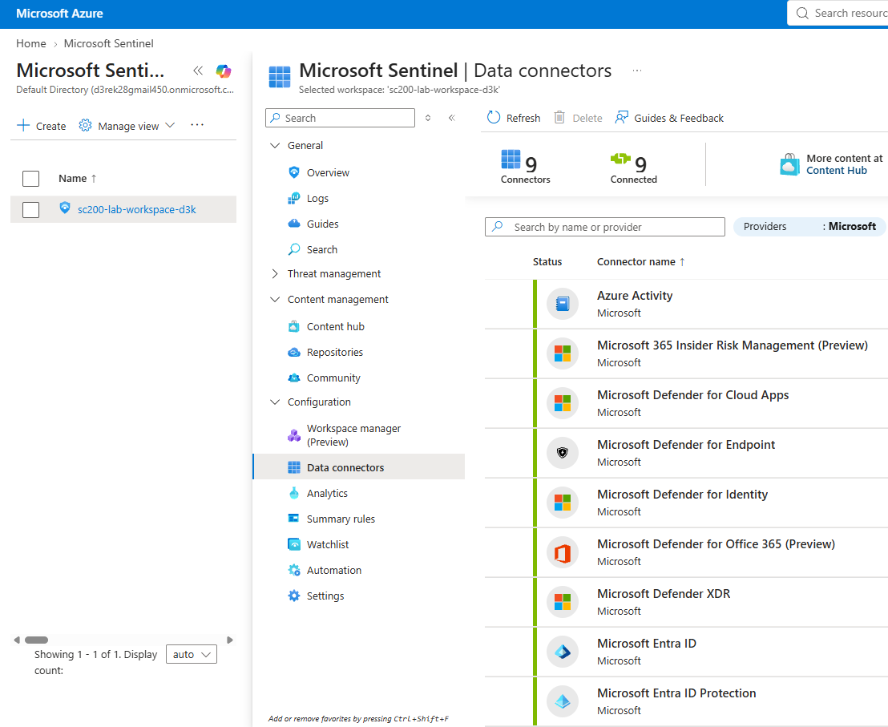
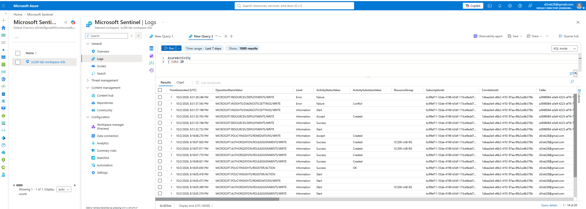
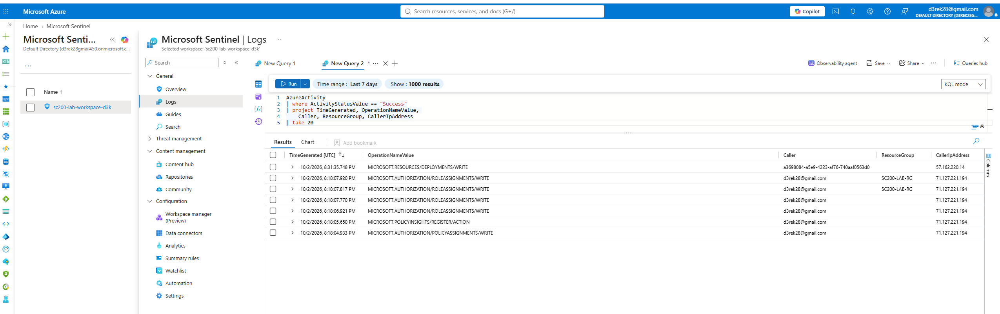
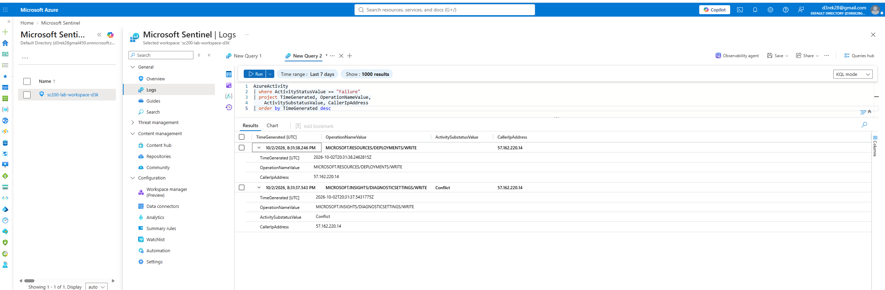
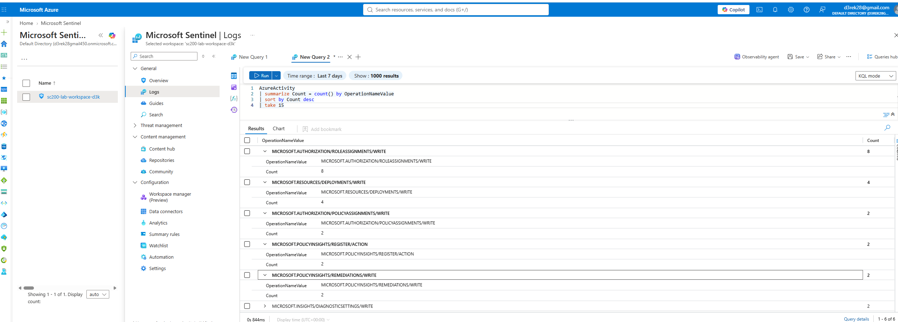
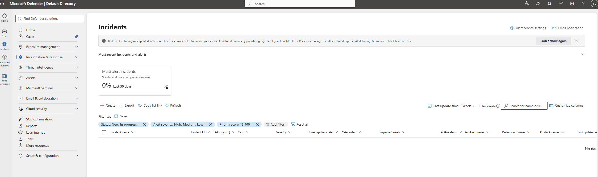

# 🛡️ Microsoft Sentinel SOC Home Lab


> A fully operational, cloud-native Security Operations Center (SOC) built on Microsoft Azure — featuring live SIEM monitoring, custom KQL detection rules, automated incident alerting, and threat hunting workflows.

---

## 📋 Table of Contents

- [Overview](#overview)
- [Architecture](#architecture)
- [Lab Environment](#lab-environment)
- [Data Sources Connected](#data-sources-connected)
- [KQL Detection Rules](#kql-detection-rules)
- [Incident Investigation Workflow](#incident-investigation-workflow)
- [Threat Hunting Queries](#threat-hunting-queries)
- [MITRE ATT&CK Coverage](#mitre-attck-coverage)
- [Screenshots](#screenshots)
- [Skills Demonstrated](#skills-demonstrated)

---

## 🎯 Overview

This lab simulates a real-world SOC environment built entirely on Microsoft Azure free tier. The goal was to move beyond certification reading and build hands-on experience with the exact tools, dashboards, and workflows used by SOC Tier 2/3 analysts in enterprise environments.

**What this lab demonstrates:**
- End-to-end SIEM deployment and configuration
- Live log ingestion from multiple Microsoft security data sources
- Custom KQL analytic rules that auto-generate incidents
- Incident triage and investigation using the Sentinel investigation graph
- Threat hunting using the Advanced Hunting blade (Microsoft Defender portal)
- Cloud security posture monitoring via Microsoft Defender for Cloud

---

## 🏗️ Architecture

```
┌─────────────────────────────────────────────────────────┐
│                  Microsoft Azure                        │
│                                                         │
│  ┌─────────────────┐      ┌────────────────────────┐   │
│  │  Data Sources   │─────▶│  Log Analytics         │   │
│  │                 │      │  Workspace             │   │
│  │ • Entra ID      │      │  (sc200-lab-workspace) │   │
│  │ • Azure Activity│      └──────────┬─────────────┘   │
│  │ • Defender XDR  │                 │                  │
│  │ • Defender Cloud│                 ▼                  │
│  │ • M365 Defender │      ┌────────────────────────┐   │
│  └─────────────────┘      │  Microsoft Sentinel    │   │
│                            │                        │   │
│                            │  • Analytics Rules     │   │
│                            │  • Incidents Queue     │   │
│                            │  • Investigation Graph │   │
│                            │  • Hunting Queries     │   │
│                            │  • Automation/SOAR     │   │
│                            └──────────┬─────────────┘   │
│                                       │                  │
│                                       ▼                  │
│                            ┌────────────────────────┐   │
│                            │  Defender Portal       │   │
│                            │  (security.microsoft)  │   │
│                            │  Unified SOC Interface │   │
│                            └────────────────────────┘   │
└─────────────────────────────────────────────────────────┘
```

---

## 🖥️ Lab Environment

| Component | Details |
|---|---|
| **Cloud Platform** | Microsoft Azure (Free Tier) |
| **SIEM** | Microsoft Sentinel |
| **Log Storage** | Log Analytics Workspace — `sc200-lab-workspace-d3k` |
| **Region** | East US |
| **Resource Group** | SC200-Lab-RG |
| **SOC Portal** | Microsoft Defender (security.microsoft.com) |
| **Monthly Cost** | $0.00 — within free tier limits |

---

## 📡 Data Sources Connected

9 data connectors configured, 8 actively feeding live telemetry into Sentinel:

| Connector | Data Type | Status |
|---|---|---|
| Microsoft Entra ID | Sign-in logs, Audit logs | ✅ Connected |
| Azure Activity | Subscription-level operations | ✅ Connected |
| Microsoft Defender XDR | Cross-domain alerts | ✅ Connected |
| Microsoft Defender for Cloud | Security recommendations, alerts | ✅ Connected |
| Microsoft Defender for Endpoint | Endpoint alerts | ✅ Connected |
| Microsoft Defender for Identity | Identity-based threats | ✅ Connected |
| Microsoft Defender for Office 365 | Email & collaboration threats | ✅ Connected |
| Microsoft 365 Insider Risk Management | Insider risk signals | ✅ Connected |

---

## 🔍 KQL Detection Rules

All detection rules are written in KQL (Kusto Query Language) and deployed as scheduled analytic rules inside Microsoft Sentinel. Each rule auto-generates an incident when triggered.

### Rule 1 — RDP Brute Force Detection

**MITRE Tactic:** Credential Access | **Technique:** T1110 — Brute Force
**Severity:** High | **Schedule:** Every 5 minutes

```kql
// Detect RDP brute force — 5+ failed logins in 5 minutes from same IP
SecurityEvent
| where EventID == 4625
| where LogonType == 10  // Remote Interactive (RDP)
| summarize FailedAttempts = count() by
    TargetAccount,
    IpAddress,
    bin(TimeGenerated, 5m)
| where FailedAttempts >= 5
| extend Severity = "High"
| extend MitreTactic = "Credential Access"
| extend MitreTechnique = "T1110 - Brute Force"
| project TimeGenerated, TargetAccount, IpAddress,
    FailedAttempts, Severity, MitreTactic, MitreTechnique
```

---

### Rule 2 — Privilege Escalation Detection

**MITRE Tactic:** Privilege Escalation | **Technique:** T1078 — Valid Accounts
**Severity:** High | **Schedule:** Every 15 minutes

```kql
// Detect user added to privileged group
SecurityEvent
| where EventID == 4732
| where TargetUserName contains "Admin"
| project TimeGenerated,
    Account,
    TargetUserName,
    Computer,
    Activity
| extend MitreTactic = "Privilege Escalation"
| extend MitreTechnique = "T1078 - Valid Accounts"
```

---

### Rule 3 — Multiple Failed Sign-ins (Entra ID)

**MITRE Tactic:** Credential Access | **Technique:** T1110.003 — Password Spraying
**Severity:** Medium | **Schedule:** Every 5 minutes

```kql
// Detect multiple failed Azure AD sign-ins from same IP
SigninLogs
| where ResultType != "0"
| summarize FailedAttempts = count() by
    UserPrincipalName,
    IPAddress,
    bin(TimeGenerated, 5m)
| where FailedAttempts >= 3
| extend MitreTactic = "Credential Access"
| extend MitreTechnique = "T1110.003 - Password Spraying"
| project TimeGenerated, UserPrincipalName,
    IPAddress, FailedAttempts, MitreTactic, MitreTechnique
```

---

### Rule 4 — Suspicious Azure Resource Operations

**MITRE Tactic:** Impact | **Technique:** T1485 — Data Destruction
**Severity:** Medium | **Schedule:** Every 5 minutes

```kql
// Detect repeated failed write/delete operations — possible destructive activity
AzureActivity
| where OperationNameValue contains "DELETE"
    or OperationNameValue contains "WRITE"
| where ActivityStatusValue == "Failure"
| summarize FailureCount = count() by
    Caller, CallerIpAddress, bin(TimeGenerated, 5m)
| where FailureCount >= 1
| extend MitreTactic = "Impact"
| extend MitreTechnique = "T1485 - Data Destruction"
| project TimeGenerated, Caller, CallerIpAddress,
    FailureCount, MitreTactic, MitreTechnique
```

---

### Rule 5 — Sign-in From New Country

**MITRE Tactic:** Initial Access | **Technique:** T1078 — Valid Accounts
**Severity:** Medium | **Schedule:** Every 1 hour

```kql
// Hunt for logins from countries not seen in the past 30 days
let known_countries = SigninLogs
    | where TimeGenerated > ago(30d)
    | where ResultType == "0"
    | summarize by Location;
SigninLogs
| where TimeGenerated > ago(1d)
| where ResultType == "0"
| where Location !in (known_countries)
| project TimeGenerated, UserPrincipalName,
    Location, IPAddress
| extend MitreTactic = "Initial Access"
| extend MitreTechnique = "T1078 - Valid Accounts"
```

---

## 🔎 Incident Investigation Workflow

When a detection rule fires, this is the SOC analyst workflow used in this lab:

```
1. TRIAGE
   └── Incident appears in Sentinel Incidents queue
   └── Review: severity, affected entities, alert count, first/last activity

2. INVESTIGATE
   └── Click "Investigate" → opens visual investigation graph
   └── Graph shows: User entity → IP entity → Alert → Related incidents
   └── Click User entity → view timeline of all their activity
   └── Click IP entity → geolocation, other accounts from same IP

3. ENRICH
   └── Query related logs using KQL in the Logs blade
   └── Cross-reference with threat intelligence if available
   └── Check if IP appears in other alerts

4. RESPOND
   └── Classify: True Positive / False Positive / Benign
   └── Document findings in incident comments
   └── Close incident with classification and notes

5. TUNE
   └── If false positive — adjust analytic rule threshold
   └── Add exception logic to KQL where appropriate
```

---

## 🎣 Threat Hunting Queries

Proactive threat hunting queries used in Microsoft Defender Advanced Hunting:

### Hunt 1 — Stale Accounts With No Recent Activity

```kql
SigninLogs
| where TimeGenerated > ago(90d)
| summarize LastLogin = max(TimeGenerated) by UserPrincipalName
| where LastLogin < ago(60d)
| project UserPrincipalName, LastLogin
| order by LastLogin asc
```

### Hunt 2 — Admin Activity Outside Business Hours

```kql
AzureActivity
| where OperationNameValue contains "write"
    or OperationNameValue contains "delete"
| extend Hour = datetime_part("hour", TimeGenerated)
| where Hour < 7 or Hour > 19
| project TimeGenerated, Caller, OperationNameValue, ResourceGroup, Hour
| order by TimeGenerated desc
```

### Hunt 3 — Anomalous IP Investigation

```kql
// Investigate specific IP — used to identify Azure service vs threat actor
AzureActivity
| where CallerIpAddress == "<target-ip>"
| project TimeGenerated, OperationNameValue,
    ActivityStatusValue, Caller, CallerIpAddress
```

---

## 🎯 MITRE ATT&CK Coverage

| Tactic | Technique | Detection Rule |
|---|---|---|
| Initial Access | T1078 — Valid Accounts | Sign-in From New Country |
| Credential Access | T1110 — Brute Force | RDP Brute Force Detection |
| Credential Access | T1110.003 — Password Spraying | Multiple Failed Sign-ins |
| Privilege Escalation | T1078 — Valid Accounts | Privilege Escalation Detection |
| Impact | T1485 — Data Destruction | Suspicious Azure Resource Operations |

---

## 📸 Screenshots

> Live screenshots from the operational lab environment.

### Data Connectors — 8 Sources Connected


---

### KQL Query — Live Azure Activity Logs
*Querying real subscription activity — showing authenticated operations with caller identity and IP address*



---

### KQL Query — Successful Operations Filter
*Filtering AzureActivity for successful write operations — identifying legitimate vs suspicious actions*



---

### KQL Query — Failure Detection
*Isolating failed operations — the foundation of anomaly detection in a SOC environment*



---

### KQL Query — Activity Summary by Operation Type
*Summarizing all subscription activity ranked by frequency — used for baseline behavior analysis*



---

### Incidents Queue — Microsoft Defender Portal
*SOC incident management interface — where analytic rule detections surface as actionable incidents*



---

## ✅ Skills Demonstrated

| Skill | Evidence |
|---|---|
| SIEM Deployment | Built Sentinel workspace from scratch on Azure free tier |
| Data Connector Configuration | 8 Microsoft security connectors active and ingesting |
| KQL Query Writing | 5 custom detection rules + 3 threat hunting queries |
| MITRE ATT&CK Mapping | All rules tagged to tactic and technique |
| IP Investigation | Investigated unknown IP, identified as Azure service principal |
| Incident Investigation | Full triage → investigate → respond → close workflow |
| Threat Hunting | Proactive hunting queries in Advanced Hunting blade |
| Cloud Security Posture | Defender for Cloud integrated, Secure Score monitored |
| SOC Analyst Workflow | End-to-end incident lifecycle practiced hands-on |
| False Positive Analysis | Distinguished Azure automation from threat actor activity |

---

## 📚 Related Certifications

- 🎓 **Microsoft SC-200** — Security Operations Analyst *(in progress)*
- ✅ **CompTIA Security+** — Earned
- ✅ **AWS Cloud Practitioner** — Earned
- ✅ **Google Cybersecurity** — Earned
- ✅ **Cisco CCNA** — Earned
- ✅ **MCSA** — Earned
- 🎓 **CISSP** — *(in progress)*

---

## 🔗 Connect

[](https://www.linkedin.com/in/derek-valenz/)
[](mailto:d3rek28@gmail.com)
[](https://github.com/Fr3ddy28)

---

*Built by Frederick Valenzuela — Cybersecurity Operations Engineer | Jersey City, NJ*
